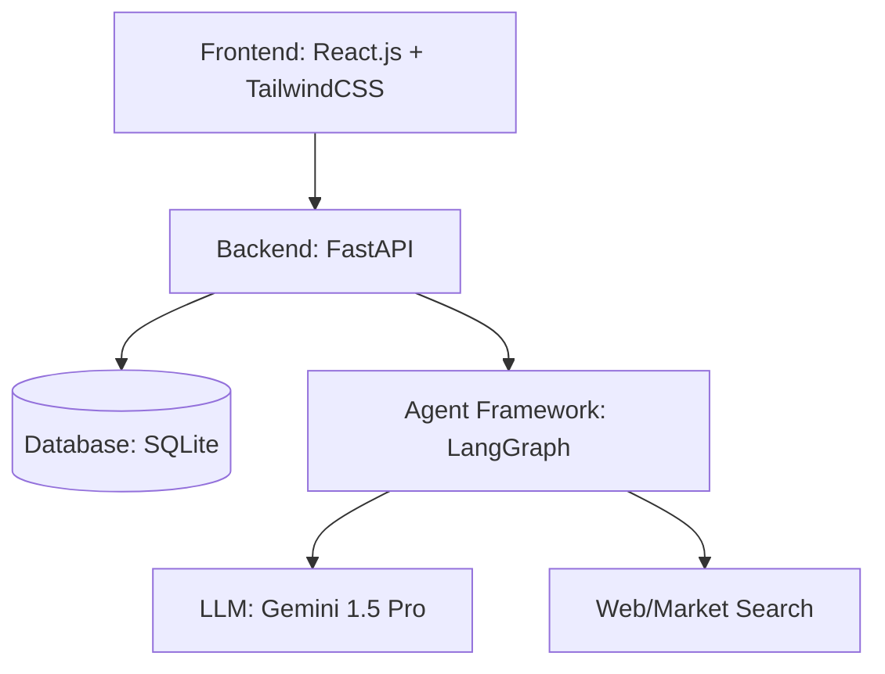
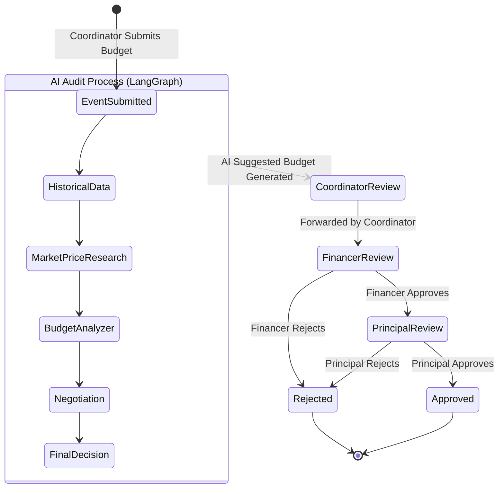
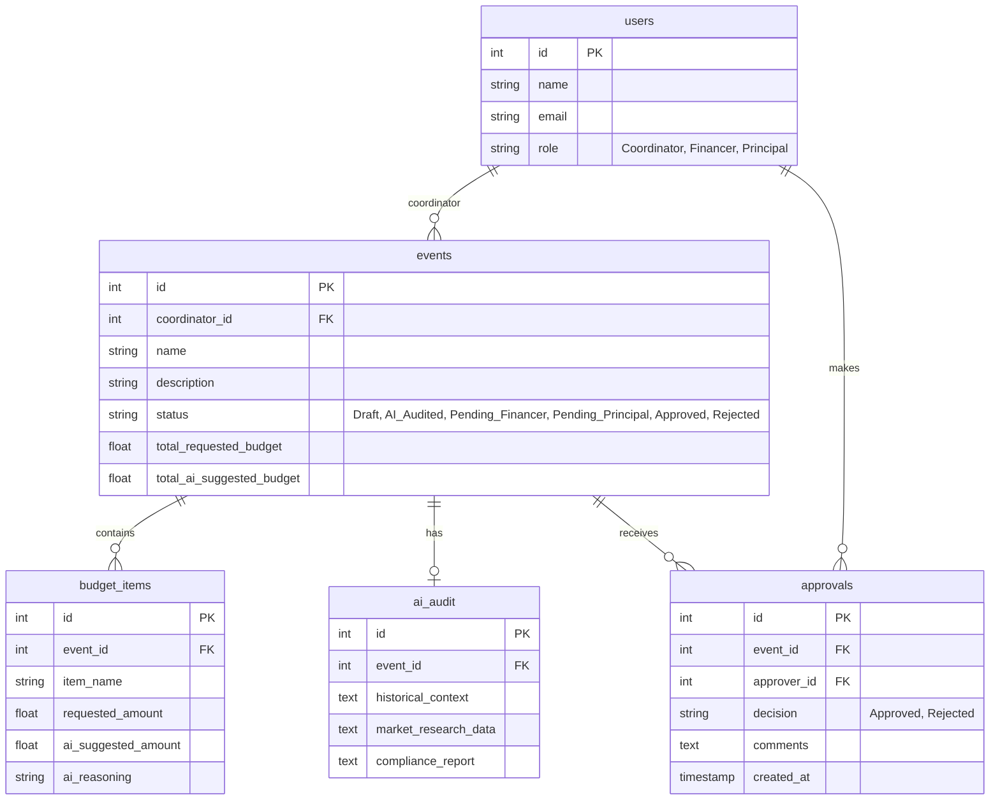

# BudgetMinds - Autonomous AI Budget Approval System

## System Architecture

The BudgetMinds system is composed of a generic multi-tier web application architecture:



## Agent Workflow Diagram



## Database Schema



## API Endpoints

### Auth / Users
- `POST /api/users/login` - Authenticate user

### Coordinator
- `POST /api/events/` - Submit event budget
- `GET /api/events/{event_id}` - View event and AI Audit
- `POST /api/events/{event_id}/forward/financer` - Forward to Financer

### Financer
- `GET /api/events/pending/financer` - List pending events for Financer
- `POST /api/events/{event_id}/approve/financer` - Approve and forward to Principal
- `POST /api/events/{event_id}/reject` - Reject budget

### Principal
- `GET /api/events/pending/principal` - List pending events for Principal
- `POST /api/events/{event_id}/approve/principal` - Final validation
- `POST /api/events/{event_id}/reject` - Final rejection

## Folder Structure

```
BudgetMinds/
├── backend/
│   ├── main.py
│   ├── database.py
│   ├── models.py
│   ├── schemas.py
│   ├── agents.py
│   └── requirements.txt
├── frontend/ (React.js)
│   ├── src/
│   │   ├── components/
│   │   ├── pages/
│   │   ├── services/
│   │   ├── App.jsx
│   │   └── index.css
│   ├── package.json
│   └── tailwind.config.js
└── docs/
    └── architecture.md
```
